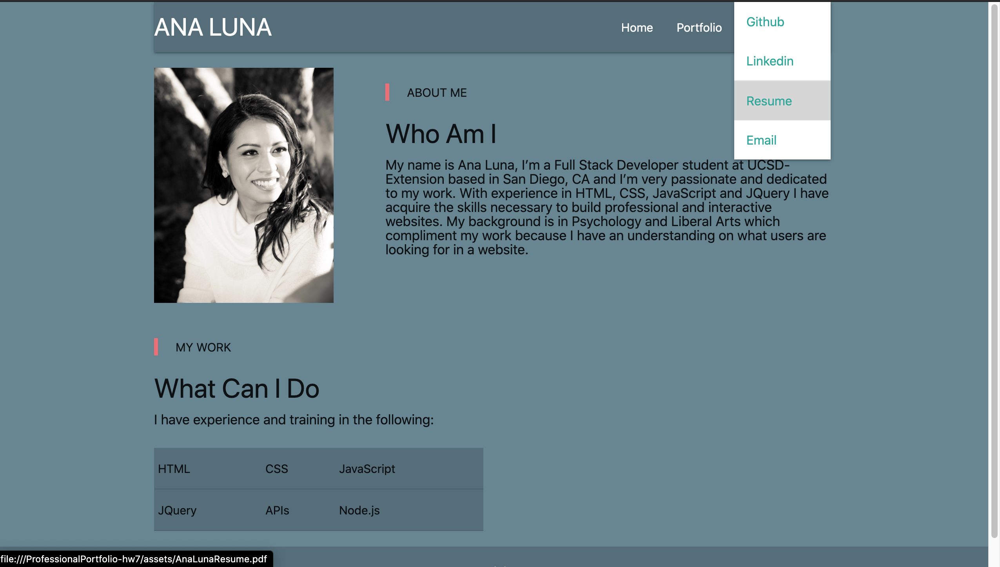
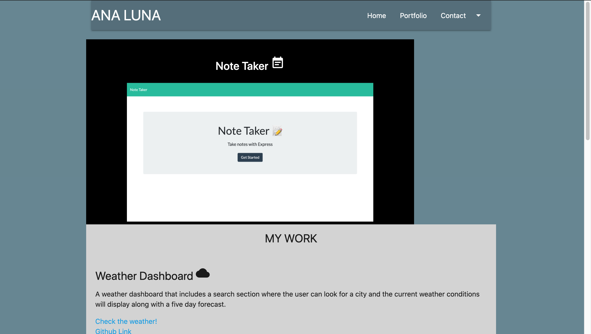
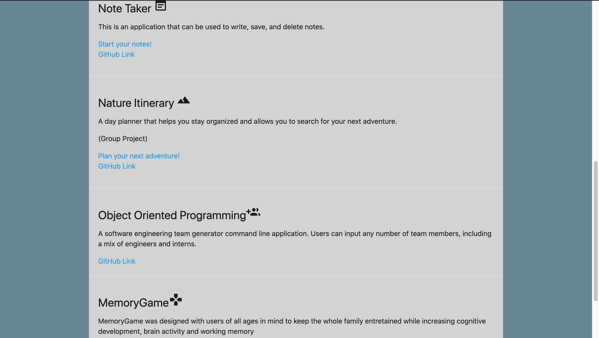

# ProfessionalPortfolio-hw7
Updated version of the responsive portfolio-hw2

## Live link to deployed app:

https://analuna01.github.io/ProfessionalPortfolio-hw7/

## Technologies used:
HTML,
JAVASCRIPT,
CSS,
MATERIALIZE.

## Comments: 
The purpose of this assignment was to develop an updated version of our "Responsive Portfolio-hw2" using our new knowledge to create a professional portfolio that included a biography, our most recent work as developers and our contact information.

## Screenshots of deployed app:

HOME:

PORTFOLIO:

MY WORK:

